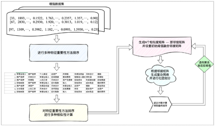
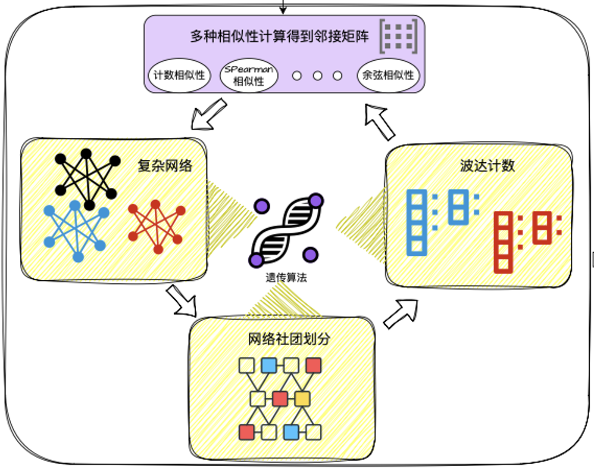

# 	   Adaptive Data-Select

​						   `一种自适应特征筛选管道`｜[English README](./README.md)

## Backgroud

虽然特征增强在一定程度上扩展了中小微企业融资担保评估所需的特征信息，为模型提供了更丰富的数据支持，但仅依赖特征增强远远不够，因为特征增强不可避免地引入冗余或无关特征。这些噪声特征不仅增加了模型的复杂性，还会干扰评估的精准性，甚至影响模型性能的稳定性，尤其是在财务数据中，特征之间往往具有强相关性或存在多重共线性。因此，在这一背景下，引入特征筛选作为提升评估效率和效果的重要手段显得尤为必要。然而，以往的特征筛选研究大多采用单一的方法，没有充分结合多种筛选策略来处理中小微企业财务数据的复杂性和特征间的关系。单一筛选方法可能会忽略特征之间的交互作用和潜在价值，导致模型在应对实际复杂场景时表现不足。
为了解决这些问题，本项目拟研究基于分组集成策略的特征选择方法，通过多阶段、多视角的筛选机制，提升特征选择的科学性和适用性，如图2-7所示。本项目从两个核心目标出发：首先是保证特征的异质性，基于特征之间的差异性提出一种新的特征分组方法，从而尽可能减少特征的相似性和冗余性，避免多重共线性对模型预测产生的负面影响；其次是从分组特征中挖掘最优性的特征，研究并设计排序算法对分组后的特征进行排序和优选，确保选取的特征具备最佳的中小微企业融资担保评估分类和预测能力，从而提升模型的整体性能。通过以上两个阶段筛选出适用于中小微企业融资担保评估的优秀特征。

## Introduction

​	本项目提出一种创新的特征重要性综合筛选方法，叫**Adaptive Data-Select (ADS)**，利用多种不同的计算手段对特征进行排序，从而选择最优的特征集合以提高机器学习模型的性能。思路如下：首先，使用多种方法计算特征的重要性，并得到相应的特征排序。常见的特征重要性评估方法包括：基于模型的方法（如基于决策树的特征重要性评估）、基于统计的特征选择方法（如ANOVA、互信息量等）、以及基于信息论的评估方法。通过这些方法得到多个特征的排序结果。不同方法的多样性可以减少单一方法带来的偏差，从而为后续的特征筛选提供更可靠的信息。接下来，为了综合各个特征排序，研究将采用四种相似性计算方法，分别为：
**计数方法**：通过直接统计两个排序中相同的特征数量来衡量它们的相似性。
**Spearman等级相关系数**：通过衡量两个排序的等级一致性来计算它们的相似性，公式如下： 
$$
\rho=1-\frac{6\sum d_i^2}{n(n^2-1)}
$$
其中，$d_i$为第i个特征在两个排序中的差异，为特征的总数。Spearman系数值接近1表明排序高度相似。
**Kendall相关系数**：通过计算排序对的 concordant 和 discordant 数量来衡量排序相似性，公式为：
$$
\tau=\frac{C-D}{\sqrt{(C+D+T_1)(C+D+T_2)}}
$$
其中，C是顺序对的数量，是逆序对的数量，$T_1$ 和$T_2$ 分别是存在相同等级的顺序对和逆序对的数量。
**余弦相似性**：用来衡量两个排序向量之间的相似度，公式为：
$$
\operatorname{cosin}\mathsf{e}(A,B)=\frac{A\cdot B}{\parallel A\parallel\parallel B\parallel}
$$
其中，A和B为两个排序向量，点积计算两个排序之间的相似度，余弦值越接近1，表示排序越相似。

​	通过这四种方法分别计算每对特征排序之间的相似性，最终得到四组相似性矩阵，能够反映不同排序之间的关系。其次，对这四组相似性矩阵进行加权求和，形成一个综合相似性矩阵。具体而言，每个相似性矩阵的权重可以根据其在特定应用场景下的重要性进行调整。这一加权求和的过程确保了每种排序方法的特征重要性都能在最终的决策中占有一定份额。得到的综合相似性矩阵可通过设置阈值得到一个邻接矩阵，通过该矩阵构建网络图，将特征作为图中的节点。紧接着，使用 Louvain算法 对网络图进行社团划分。

​	在每个社团内，使用波达计数法将社团内的特征排序进行合并，波达计数法通过对排序的排名进行加权平均来获得社团内的代表性排序。具体方法是：对于社团内的所有排序，按照各排序中的特征排名进行加权，得出每个特征的最终排序位置。将各个社团的代表排序进行汇总，以获得最终的特征排序。这一过程同样采用波达计数法，将社团代表排序作为输入，生成全局的最终特征重要性排序。该步骤能够有效结合不同社团的代表特征排序信息，从而减少局部优化的偏差。

​	为了进一步优化特征筛选的效果，引入进化算法来自适应调整矩阵的权重、筛选的特征数和阈值，达到最优性能。进化算法通过模拟自然选择过程，逐代优化权重和特征选择策略。在进化过程中，算法不断评估特征子集对模型性能的影响，并根据适应度函数调整选择特征和阈值。适应度函数可以基于模型在验证集上的准确性或其他评价指标来设计。通过进化算法的自适应机制，最终获得一个在多方面表现良好的特征集合。

​	该方法通过多角度计算特征重要性，融合不同排序方法的信息，并通过网络社团划分和波达计数法合并排序，有效克服了单一排序方法的偏差。结合进化算法进行自适应调整，使得特征筛选更加精确，具有较强的普适性和可操作性。最终，该方法不仅提升了机器学习模型的性能，同时也为中小微企业结构化特征选择问题提供了一种新的思路和解决方案。

## Operation

**在使用该管道时**，将需要进行特征筛选的 训练集和测试集放到 **data**文件夹中，并修改代码中的调用，`data1`对应训练集，`data2`对应测试集。该算法会将所有计算特征重要性方法的结果保存到`sort_feature_importances.csv`，并且算法会将筛选得到的最优的x个特征输出在控制台，并且输出进化算法得到的参数。

### - 特征筛选算法管道.py
    该文件为算法原始版，针对上传数据集设计的特征筛选算法，如果换数据集不便于修改。
### - 特征筛选算法管道-完整版.py
    该文件为优化版，将对数据集的预处理部分封装成函数并设定为`data_load`，在使用该算法时，只需要针对不同数据集修改该部分代码即可，如修改数据预处理部分，或划分X、y。
