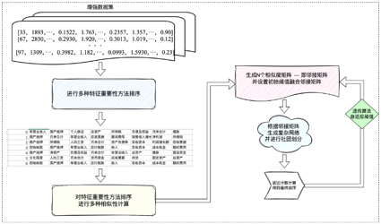

# 	Adaptive Data-Select

​		`An Adaptive Feature Selection Pipeline`｜[中文文档](./README-zh.md)

## Background

Although feature augmentation expands the feature information required for the financing guarantee assessment of small and medium-sized enterprises (SMEs) to a certain extent, providing richer data support for the model, relying solely on feature augmentation is far from sufficient. This is because feature augmentation inevitably introduces redundant or irrelevant features. These noisy features not only increase the complexity of the model but also interfere with the accuracy of the assessment, even affecting the stability of the model's performance. This is especially true in financial data, where features often exhibit strong correlations or multicollinearity. Therefore, in this context, introducing feature selection as an important means to improve assessment efficiency and effectiveness becomes particularly necessary. However, most previous feature selection studies have adopted single methods, failing to fully integrate multiple selection strategies to address the complexity of SME financial data and the relationships between features. Single selection methods may overlook the interactions and potential value between features, leading to insufficient performance of the model in real-world complex scenarios.

To address these issues, this project proposes to study a feature selection method based on a grouped integration strategy, enhancing the scientific and practical applicability of feature selection through a multi-stage, multi-perspective screening mechanism, as shown in Figure 2-7. This project starts from two core objectives: first, to ensure the heterogeneity of features by proposing a new feature grouping method based on the differences between features, thereby minimizing feature similarity and redundancy and avoiding the negative impact of multicollinearity on model predictions; second, to mine the optimal features from the grouped features by researching and designing a ranking algorithm to sort and select the grouped features, ensuring that the selected features possess the best classification and predictive capabilities for SME financing guarantee assessment, thereby improving the overall performance of the model. Through these two stages, the project aims to select excellent features suitable for SME financing guarantee assessment.

## Introduction

This project proposes an innovative comprehensive feature importance selection method called **Adaptive Data-Select (ADS)**, which utilizes various computational techniques to rank features and select the optimal feature set to improve the performance of machine learning models. The approach is as follows: First, multiple methods are used to calculate feature importance, resulting in corresponding feature rankings. Common feature importance evaluation methods include model-based methods (e.g., decision tree-based feature importance evaluation), statistical-based feature selection methods (e.g., ANOVA, mutual information), and information theory-based evaluation methods. These methods yield multiple feature ranking results. The diversity of methods reduces the bias introduced by a single method, providing more reliable information for subsequent feature selection. Next, to integrate these feature rankings, the study employs four similarity calculation methods:

**Counting Method**: Measures similarity by directly counting the number of identical features in two rankings.

**Spearman Rank Correlation Coefficient**: Measures the consistency of ranks between two rankings, calculated as:
$$
\rho=1-\frac{6\sum d_i^2}{n(n^2-1)}
$$
where \(d_i\) is the difference in ranks for the \(i\)-th feature in the two rankings, and \(n\) is the total number of features. A Spearman coefficient close to 1 indicates high similarity.

**Kendall Correlation Coefficient**: Measures ranking similarity by counting the number of concordant and discordant pairs, calculated as:
$$
\tau=\frac{C-D}{\sqrt{(C+D+T_1)(C+D+T_2)}}
$$
where \(C\) is the number of concordant pairs, \(D\) is the number of discordant pairs, and\(T_1\) and \(T_2\) are the numbers of tied pairs in the two rankings.

**Cosine Similarity**: Measures the similarity between two ranking vectors, calculated as:
$$
\operatorname{cosine}(A,B)=\frac{A\cdot B}{\parallel A\parallel\parallel B\parallel}
$$
where \(A\) and \(B\) are the two ranking vectors. A cosine value close to 1 indicates high similarity.

Using these four methods, the similarity between each pair of feature rankings is calculated, resulting in four similarity matrices that reflect the relationships between different rankings. Next, these four similarity matrices are weighted and summed to form a comprehensive similarity matrix. Specifically, the weight of each similarity matrix can be adjusted based on its importance in a specific application scenario. This weighted summation ensures that the feature importance of each ranking method is proportionally represented in the final decision. The resulting comprehensive similarity matrix is then converted into an adjacency matrix by setting a threshold, and a network graph is constructed with features as nodes. Subsequently, the Louvain algorithm is used to perform community detection on the network graph.

Within each community, the Borda count method is used to merge the feature rankings within the community. The Borda count method calculates a representative ranking for the community by weighted averaging of the ranks in all rankings. Specifically, for all rankings within a community, the ranks of each feature are weighted to determine its final position in the representative ranking. The representative rankings of all communities are then aggregated to obtain the final feature ranking. This process also uses the Borda count method, taking the community representative rankings as input to generate a global final feature importance ranking. This step effectively combines the representative feature rankings of different communities, reducing the bias of local optimization.

To further optimize the feature selection process, an evolutionary algorithm is introduced to adaptively adjust the weights of the matrices, the number of selected features, and the threshold to achieve optimal performance. The evolutionary algorithm simulates the natural selection process, iteratively optimizing the weights and feature selection strategies. During the evolution, the algorithm continuously evaluates the impact of feature subsets on model performance and adjusts the feature selection and threshold based on a fitness function. The fitness function can be designed based on the model's accuracy on the validation set or other evaluation metrics. Through the adaptive mechanism of the evolutionary algorithm, a feature set that performs well in multiple aspects is ultimately obtained.

This method calculates feature importance from multiple perspectives, integrates information from different ranking methods, and merges rankings through community detection and the Borda count method, effectively overcoming the bias of single ranking methods. Combined with the adaptive adjustment of the evolutionary algorithm, the feature selection becomes more precise, with strong universality and operability. Ultimately, this method not only improves the performance of machine learning models but also provides a new approach and solution for structured feature selection in SMEs.

## Operation

**When using this pipeline**, place the training and test sets that require feature selection in the **data** folder and modify the code calls accordingly. `data1` corresponds to the training set, and `data2` corresponds to the test set. The algorithm will save the results of all feature importance calculation methods to `sort_feature_importances.csv`. Additionally, the algorithm will output the optimal \(x\) features selected by the evolutionary algorithm in the console, along with the parameters obtained by the evolutionary algorithm.

### - Feature Selection Algorithm Pipeline.py
    This file is the original version of the algorithm, designed for the uploaded dataset. It is not convenient to modify for other datasets.
### - Feature Selection Algorithm Pipeline - Complete Version.py
    This file is the optimized version, encapsulating the data preprocessing part into a function named `data_load`. When using this algorithm, you only need to modify this part of the code for different datasets, such as adjusting the data preprocessing or dividing \(X\) and \(y\).
